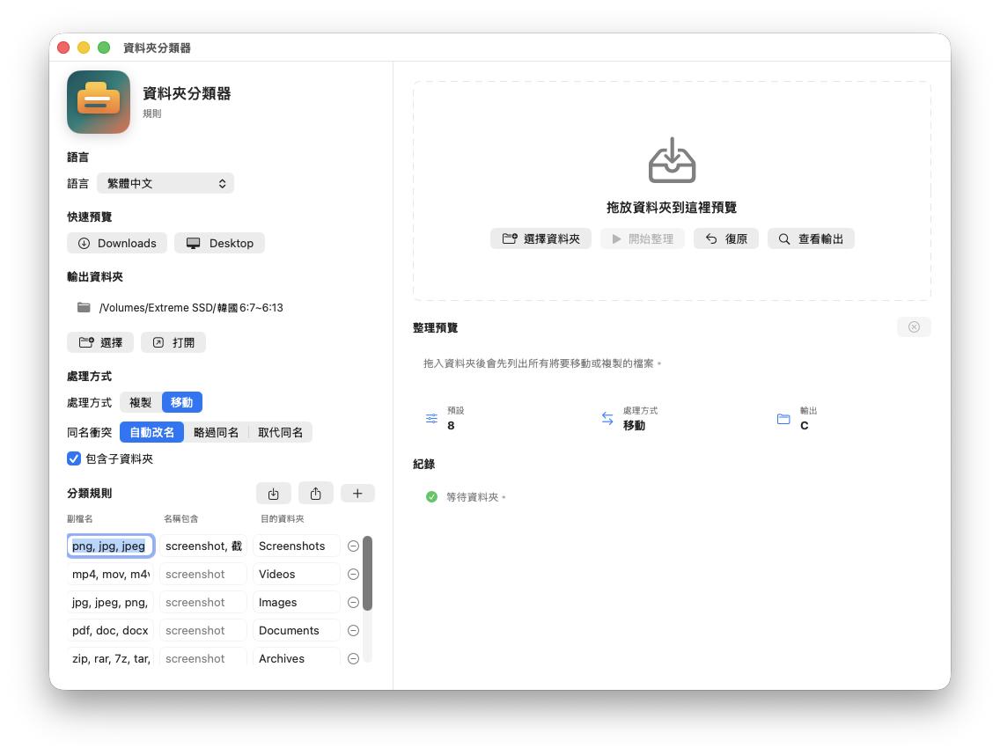

# FolderSorter

[English-only](README.en.md) | [繁體中文獨立版](README.zh-TW.md)

FolderSorter is a safe, open-source macOS file organizer.

FolderSorter 是一個安全、開源、預覽優先的 macOS 檔案整理器。

<p align="center">
  
</p>

<p align="center">
  
</p>

[Launch and discoverability plan](DISCOVERABILITY.md) |
[Roadmap](ROADMAP.md) |
[pip distribution](PYPI.md) |
[GitHub social preview asset](Media/foldersorter-social-preview.jpg)

## English

FolderSorter is built for the common Mac problem: a messy Downloads folder,
Desktop, screenshots pile, and random PDFs, ZIPs, DMGs, videos, and images.
Unlike tools that immediately move files, FolderSorter previews every operation
first and can undo the last cleanup.

### Highlights

- **Preview-first cleanup**: drag files or folders in, inspect the plan, then apply.
- **One-click undo**: every applied cleanup writes a local transaction record.
- **Common Mac defaults**: Images, Videos, Documents, Archives, Installers, Audio, Code, and Screenshots.
- **Conflict control**: automatically rename, skip, or replace same-name files.
- **Rules you can read**: rules can be imported and exported as JSON.
- **GUI + CLI**: a simple Mac app for everyday use and a `foldersorter` CLI for automation.
- **Bilingual interface**: follow system language, English, or Traditional Chinese.
- **Local-first privacy**: no uploads, no analytics, no network feature.

### Requirements

- macOS 14 or newer
- Xcode command line tools or Xcode with SwiftPM

### Run The App

```bash
./script/build_and_run.sh
```

The generated app bundle is written to:

```text
dist/FolderSorter.app
```

### Install The CLI With pip

Before the package is published to PyPI, install directly from GitHub:

```bash
python3 -m pip install "git+https://github.com/kodlbegiko/FolderSorter.git"
foldersorter --help
```

After the package is published to PyPI:

```bash
python3 -m pip install foldersorter
foldersorter --help
```

The pip package currently installs the CLI wrapper. It requires the Swift
toolchain because the first `foldersorter` run builds the Swift CLI locally.
PyPI publishing is prepared through the `Publish PyPI` GitHub Actions workflow
and documented in `PYPI.md`.

### Use The App

1. Open the app.
2. Choose an output folder, or use the default Desktop `C` folder.
3. Drag in a folder, click `Downloads`, click `Desktop`, or choose files manually.
4. Review the preview.
5. Click `Start Sorting` only when the plan looks right.
6. Use `Undo` to revert the latest cleanup.

The default mode is copy, so original files stay in place. Move mode is available
when you want a real cleanup.

The app includes a language picker with `System`, `English`, and `繁體中文`.

### CLI

Preview only:

```bash
swift run foldersorter --input ~/Downloads --output ~/Desktop/C
```

Apply the preview:

```bash
swift run foldersorter --input ~/Downloads --output ~/Desktop/C --apply
```

Move instead of copy:

```bash
swift run foldersorter --input ~/Downloads --output ~/Desktop/C --move --apply
```

Use exported or example rules:

```bash
swift run foldersorter \
  --input ~/Downloads \
  --output ~/Desktop/C \
  --rules Examples/general-mac-cleanup.rules.json
```

Undo the latest applied cleanup:

```bash
swift run foldersorter --undo
```

### Rule Format

Rules are evaluated in order. A rule matches when all filled conditions match.
For example, the screenshot rule checks both file extension and filename tokens:

```json
{
  "extensionsText": "png, jpg, jpeg",
  "nameContainsText": "screenshot, 截圖",
  "folderName": "Screenshots"
}
```

### Development

Run tests:

```bash
swift test
```

Build all products:

```bash
swift build
```

Generate app icons:

```bash
swift script/generate_icon.swift
```

### Project Positioning

FolderSorter is not trying to clone Hazel. The goal is a safer, simpler,
transparent organizer for the broadest Mac audience:

- easier than complex automation tools,
- safer than one-shot cleaners,
- more transparent than closed-source apps,
- more approachable than CLI-only organizers.

### Next Priorities

- **Downloadable release**: ship a `.zip` first, then `.dmg`, so users do not need to run `swift build`.
- **Stronger GUI rules**: add visual conditions for file size, dates, screenshots, duplicates, and broad file types.
- **Before / after comparison**: show the messy source folder beside the planned organized output.

### Help This Project Grow

FolderSorter is positioned as a macOS Downloads cleaner, screenshot organizer,
and local-first file management utility for non-technical Mac users first, while
still keeping CLI and JSON rules for power users.

- Star or share the repository if the preview-first workflow solves a real cleanup problem.
- Use the included UI screenshot when writing posts or issue discussions.
- Use `Media/foldersorter-social-preview.jpg` as the GitHub social preview image.
- See `DISCOVERABILITY.md` for the launch checklist and posting copy.

## 繁體中文

FolderSorter 解決的是最常見的 Mac 混亂問題：Downloads 爆滿、桌面塞滿
截圖、PDF、ZIP、DMG、影片、圖片和各種臨時檔。FolderSorter 不會一開始
就移動檔案，而是先產生整理預覽，讓你確認之後再套用；套用後也能復原
上一筆整理。

### 特色

- **整理前先預覽**：拖入檔案或資料夾，先看完整計畫，再決定是否套用。
- **一鍵復原**：每次套用整理都會留下本機 transaction 紀錄。
- **一般 Mac 預設分類**：Screenshots、Images、Videos、Documents、Archives、Installers、Audio、Code。
- **同名衝突控制**：自動改名、略過同名、或取代同名。
- **規則透明**：分類規則可以匯入與匯出成 JSON。
- **GUI + CLI**：一般使用者用 Mac app，進階使用者可用 `foldersorter` CLI 自動化。
- **雙語介面**：可跟隨系統語言，也可手動選 English 或繁體中文。
- **本機優先隱私**：不會上傳檔案、檔名、規則，也沒有分析追蹤。

### 系統需求

- macOS 14 或更新版本
- Xcode Command Line Tools 或包含 SwiftPM 的 Xcode

### 執行 App

```bash
./script/build_and_run.sh
```

產生的 app bundle 會放在：

```text
dist/FolderSorter.app
```

### 使用 pip 安裝 CLI

在套件正式發布到 PyPI 之前，可以先直接從 GitHub 安裝：

```bash
python3 -m pip install "git+https://github.com/kodlbegiko/FolderSorter.git"
foldersorter --help
```

發布到 PyPI 之後：

```bash
python3 -m pip install foldersorter
foldersorter --help
```

目前 pip 套件安裝的是 CLI wrapper，不是 SwiftUI app bundle。第一次執行
`foldersorter` 時會在本機 build Swift CLI，因此需要 Xcode 或 Xcode Command
Line Tools。PyPI 發布流程已經透過 `Publish PyPI` GitHub Actions workflow
準備好，詳細設定寫在 `PYPI.md`。

### 使用方式

1. 打開 app。
2. 選擇輸出資料夾，或使用預設的桌面 `C` 資料夾。
3. 拖入資料夾、點 `Downloads`、點 `Desktop`，或手動選擇檔案。
4. 檢查整理預覽。
5. 確認計畫沒問題後再按 `開始整理`。
6. 需要回復時按 `復原`，可復原上一筆整理。

預設模式是複製，所以原始檔案會留在原處。若你想真正清理原資料夾，
可以切換到移動模式。

app 左側有語言選單，可選 `System / 跟隨系統`、`English` 或 `繁體中文`。

### CLI

只預覽，不移動或複製檔案：

```bash
swift run foldersorter --input ~/Downloads --output ~/Desktop/C
```

套用預覽：

```bash
swift run foldersorter --input ~/Downloads --output ~/Desktop/C --apply
```

改成移動模式：

```bash
swift run foldersorter --input ~/Downloads --output ~/Desktop/C --move --apply
```

使用匯出的規則或範例規則：

```bash
swift run foldersorter \
  --input ~/Downloads \
  --output ~/Desktop/C \
  --rules Examples/general-mac-cleanup.rules.json
```

復原上一筆已套用的整理：

```bash
swift run foldersorter --undo
```

### 規則格式

規則會依照順序檢查。每條規則中有填寫的條件都必須符合。
例如截圖規則會同時檢查副檔名和檔名關鍵字：

```json
{
  "extensionsText": "png, jpg, jpeg",
  "nameContainsText": "screenshot, 截圖",
  "folderName": "Screenshots"
}
```

### 開發

執行測試：

```bash
swift test
```

建置所有 products：

```bash
swift build
```

產生 app icon：

```bash
swift script/generate_icon.swift
```

### 專案定位

FolderSorter 不是要複製 Hazel。它的目標是做出更安全、更簡單、更透明，
適合最大多數 Mac 使用者的檔案整理器：

- 比複雜自動化工具更容易上手；
- 比一次性清理工具更安全；
- 比閉源工具更透明；
- 比純 CLI 工具更適合一般使用者。

### 下一步優先事項

- **可下載版本**：先提供 `.zip`，再補 `.dmg`，讓使用者不需要跑 `swift build`。
- **強化 GUI 規則**：加入檔案大小、日期、截圖、重複檔、檔案大類型等視覺化條件。
- **整理前後對照**：左邊顯示原始混亂資料夾，右邊顯示預計整理後的輸出結果。

### 幫助更多人看見

FolderSorter 的定位是給一般 Mac 使用者的 Downloads 清理工具、截圖整理器、
本機優先檔案管理工具；同時保留 CLI 與 JSON 規則給進階使用者。

- 如果預覽優先的整理流程真的解決你的問題，可以 star 或分享這個 repo。
- 寫文章、貼文或 issue 討論時，可以直接使用 repo 內的 UI 展示圖。
- `Media/foldersorter-social-preview.jpg` 可作為 GitHub social preview 圖片。
- `DISCOVERABILITY.md` 裡有 launch checklist 與中英文推廣文案。

## License / 授權

MIT
