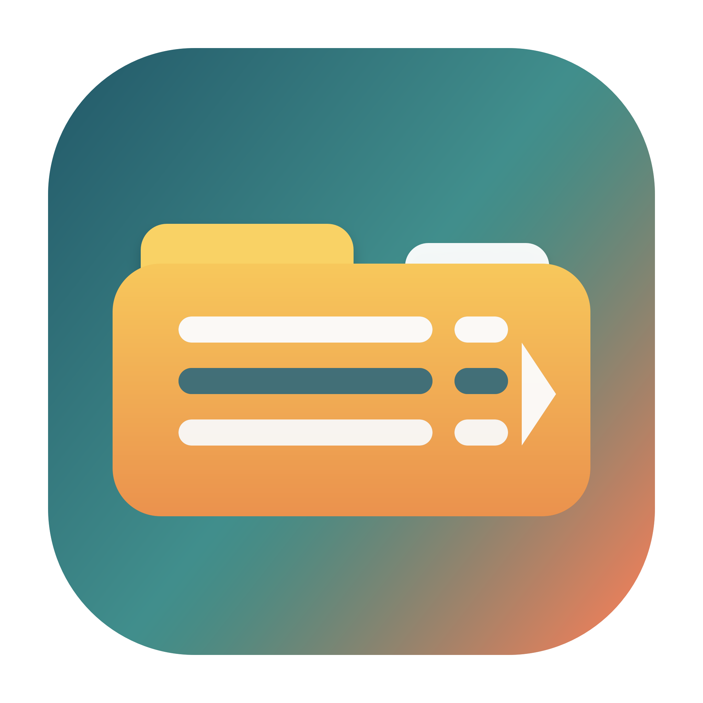

# FolderSorter

[雙語 README](README.md) | [English](README.en.md) | [繁體中文](README.zh-TW.md)

FolderSorter 是一個安全、開源、預覽優先的 macOS 檔案整理器。

它解決的是最常見的 Mac 混亂問題：Downloads 爆滿、桌面塞滿截圖、
PDF、ZIP、DMG、影片、圖片和各種臨時檔。FolderSorter 不會一開始就
移動檔案，而是先產生整理預覽，讓你確認之後再套用；套用後也能復原
上一筆整理。



## 特色

- **整理前先預覽**：拖入檔案或資料夾，先看完整計畫，再決定是否套用。
- **一鍵復原**：每次套用整理都會留下本機 transaction 紀錄。
- **一般 Mac 預設分類**：Screenshots、Images、Videos、Documents、Archives、Installers、Audio、Code。
- **同名衝突控制**：自動改名、略過同名、或取代同名。
- **規則透明**：分類規則可以匯入與匯出成 JSON。
- **GUI + CLI**：一般使用者用 Mac app，進階使用者可用 `foldersorter` CLI 自動化。
- **雙語介面**：可跟隨系統語言，也可手動選 English 或繁體中文。
- **本機優先隱私**：不會上傳檔案、檔名、規則，也沒有分析追蹤。

## 系統需求

- macOS 14 或更新版本
- Xcode Command Line Tools 或包含 SwiftPM 的 Xcode

## 執行 App

```bash
./script/build_and_run.sh
```

產生的 app bundle 會放在：

```text
dist/FolderSorter.app
```

## 使用方式

1. 打開 app。
2. 選擇輸出資料夾，或使用預設的桌面 `C` 資料夾。
3. 拖入資料夾、點 `Downloads`、點 `Desktop`，或手動選擇檔案。
4. 檢查整理預覽。
5. 確認計畫沒問題後再按 `開始整理`。
6. 需要回復時按 `復原`，可復原上一筆整理。

預設模式是複製，所以原始檔案會留在原處。若你想真正清理原資料夾，
可以切換到移動模式。

app 左側有語言選單，可選 `System / 跟隨系統`、`English` 或 `繁體中文`。

## CLI

只預覽，不移動或複製檔案：

```bash
swift run foldersorter --input ~/Downloads --output ~/Desktop/C
```

套用預覽：

```bash
swift run foldersorter --input ~/Downloads --output ~/Desktop/C --apply
```

改成移動模式：

```bash
swift run foldersorter --input ~/Downloads --output ~/Desktop/C --move --apply
```

使用匯出的規則或範例規則：

```bash
swift run foldersorter \
  --input ~/Downloads \
  --output ~/Desktop/C \
  --rules Examples/general-mac-cleanup.rules.json
```

復原上一筆已套用的整理：

```bash
swift run foldersorter --undo
```

## 規則格式

規則會依照順序檢查。每條規則中有填寫的條件都必須符合。
例如截圖規則會同時檢查副檔名和檔名關鍵字：

```json
{
  "extensionsText": "png, jpg, jpeg",
  "nameContainsText": "screenshot, 截圖",
  "folderName": "Screenshots"
}
```

## 開發

執行測試：

```bash
swift test
```

建置所有 products：

```bash
swift build
```

產生 app icon：

```bash
swift script/generate_icon.swift
```

## 專案定位

FolderSorter 不是要複製 Hazel。它的目標是做出更安全、更簡單、更透明，
適合最大多數 Mac 使用者的檔案整理器：

- 比複雜自動化工具更容易上手；
- 比一次性清理工具更安全；
- 比閉源工具更透明；
- 比純 CLI 工具更適合一般使用者。

## 授權

MIT
